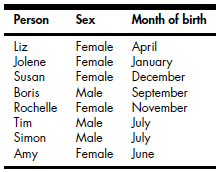

```{r setup, include=FALSE}
knitr::opts_chunk$set(echo = TRUE, fig.align = 'center')
```

## What are factors?

- A factor is a vector that can contain only predefined values.
- Factors are used to represent categorical data.

## What are factors?

- Factors are built on top of integers.

- They come with two attributes: 

  - Levels, which define the set of allowed values.
  - Their own class, "factor", which makes them behave differently from regular integers.

## Categorical variables

- Categorical variables have a limited and known set of possible outcomes.

- Categorical variables typically qualitative.

## Categorical variables

Examples:

- flip of a coin (heads or tails)
- size of a shirt (S, M, L, XL, XXL, XXXL)
- marital status (single, married, divorced, widowed)
- credit rating (very bad, bad, average, good, excellent)
- school grades (A, B, C, D, E, F)

## Categorical variables



## Creating a factor

Let´s start with a character vector:

```{r}
blood <- c("B", "AB", "O", "A", "O", "O", "A") 

blood

typeof(blood)
```

## Creating a factor

The `factor()` function encodes a vector as a factor:

```{r}
blood_factor <- factor(blood) 

blood_factor
```

Note that R sorts the levels alphabetically.

## Creating a factor

```{r}
levels(blood_factor)
typeof(blood_factor)
class(blood_factor)
```

## Order levels differently

```{r}
blood_factor2 <- factor(blood,
                    levels = c("O", "A", "B", "AB"))

blood_factor2
blood_factor
```

## The internal structure of a factor

The `str()` function displays the internal structure of an object: 

```{r}
str(blood_factor)
str(blood_factor2)
```

- Note that the values are stored as integers!

- The levels are just a set of character values to print when the factor is displayed. 

## Invalid factor level

```{r, warning=FALSE}
blood_factor

blood_factor[3] <- "C"
```

```{r}
blood_factor
```


## Table a factor

How many people there are with each type of blood?

```{r}
table(blood_factor)
table(blood_factor2)
```

## Rename factor levels

```{r}
blood_factor2 

levels(blood_factor2) <- c("BT_O", "BT_A", "BT_B",
                           "BT_AB")
blood_factor2
```

## Levels and labels

- Levels are input (alphabetic order by default). 
- Labels are associated to levels and control how they are displayed in the output.

## Levels and labels

```{r}
blood <- c("B", "AB", "O", "A", "O", "O", "A", "B") 

factor(blood)

factor(blood, 
         labels = c("BT_A", "BT_AB", "BT_B", "BT_O"))
```

## Levels and labels

```{r}
factor(blood)

factor(blood,
         levels = c("O", "A", "B", "AB"),
         labels = c("BT_O", "BT_A", "BT_B", "BT_AB"))
```

## Labels

Duplicated values in `labels` can be used to map different values of the factor to the same level:

```{r}
factor(blood)

factor(blood,
         levels = c("O", "A", "B", "AB"),
         labels = c("BT_O", "BT_A", "BT_B", "BT_A"))
```

## Nominal versus ordinal factors

```{r, warning=FALSE}
blood <- c("B", "AB", "O", "A", "O", "O", "A", "B") 
blood_factor <- factor(blood)

blood_factor[1] < blood_factor[2]
```

This logical comparison is not meaningful, since the factor is not ordered.

## Nominal versus ordinal factors

Let's build an ordered factor:

```{r}
tshirt <- c("M", "L", "S", "S", "L", "M", "L", "M")

tshirt_factor <- factor(tshirt, 
                        ordered = TRUE, 
                        levels = c("S", "M", "L"))

tshirt_factor
```

## Nominal versus ordinal factors

```{r}
tshirt_factor[1] < tshirt_factor[2]
tshirt_factor[1] > tshirt_factor[2]
```

## Bivariate tables

```{r}
hair_color <- factor(c("Brown", "Black", "Black", 
                         "Black", "Blond", "Blond", 
                         "Black", "Black"))
                         
eye_color <- factor(c( "Blue", "Blue", "Green",
                         "Green", "Green", "Blue", 
                         "Blue", "Blue"))
```

## Bivariate tables

```{r}
table(hair_color, eye_color)

```

## Three-way tables

```{r}
hair_color <- factor(c("Brown", "Black", "Black", 
                         "Black", "Blond", "Blond", 
                         "Black", "Black"))
                         
eye_color <- factor(c( "Blue", "Blue", "Green",
                         "Green", "Green", "Blue", 
                         "Blue", "Blue"))
                         
shirt_size <- factor(c("L", "S", "S", "M", "L", 
                         "L", "S", "S"),
                       ordered = TRUE)
```

## Three-way table

```{r, eval = FALSE}
table(hair_color, eye_color, shirt_size)
```

## Three-way table

\scriptsize
```{r, echo = FALSE}
table(hair_color, eye_color, shirt_size)
```
\normalsize

## Creating factors with `cut()`

- The `cut()` function transforms numerical vectors into factors.
- `cut()` breaks the range of a numerical vector into intervals.
- The limits of the intervals are provided as input.

## Creating factors with `cut()`

```{r}
y <- c(5.4, 1.5, 3.33, 0.01, 2, 4.2, 1.99, 1.01)

limits <- c(0, 2, 4, 6)

y_factor <- cut(y, breaks = limits)

y_factor

```

## Creating factors with `cut()`

```{r}
table(y_factor)
```

## Open and closed intervals

Intervals closed on the right and open on the left:

```{r}
levels(cut(y, breaks = c(0, 2, 4, 6))) 
```

Intervals open on the right and closed on the left:

```{r}
levels(cut(y, breaks = c(0, 2, 4, 6), right = FALSE)) 
```

## Open and closed intervals

Intervals closed on the right and open on the left, but including the lowest value:

```{r}


levels(cut(y, breaks = c(0, 2, 4, 6),
             include.lowest = TRUE)) 
```

Intervals open on the right and closed on the left but including the highest value:

```{r}
levels(cut(y, breaks = c(0, 2, 4, 6), right = FALSE, 
             include.lowest = TRUE)) 
```


