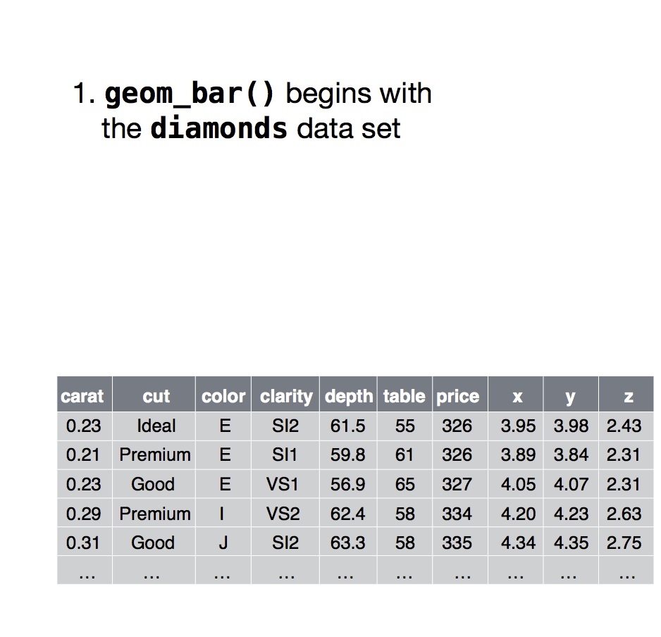
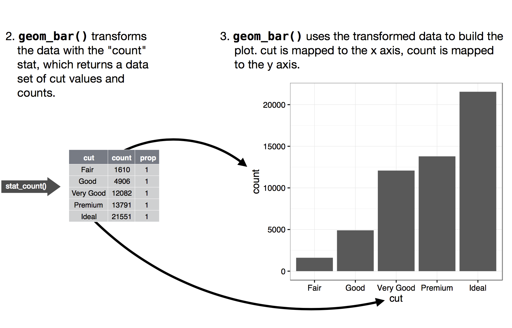

```{r setup, include=FALSE}
knitr::opts_chunk$set(echo = TRUE, out.height="150px", fig.align = 'center', message = FALSE)

library(egg)
library(tidyverse)
theme_update(
  legend.key.size = unit(3, "line"),        # legend symbols size
  legend.title = element_text(size = 22),   # legend labels
  legend.text = element_text(size = 20),    # legend text
  axis.title = element_text(size = 22),     # axis labels
  axis.text = element_text(size = 20),      # tick labels
  title = element_text(size = 22)           # title
) 
```

## The `diamonds` dataset

- Diamonds is a dataset included in the ggplot2 package.

- Contains attributes of almost 54000 diamonds. 

- The variables include price, carat, quality of the cut, color and clarity

## Bar charts

Let's use a bar chart to display the number of diamonds for each quality of cut:

```{r}
ggplot(data = diamonds) + 
  geom_bar(aes(x = cut))
```

## Statistical transformations

- On the y-axis, bar charts displays counts.

- But counts are not a variable in diamonds dataset!

- Many graphs, like scatterplots, plot the raw values the dataset. 

- Other graphs, like bar charts, calculate new values to plot.

- The algorithm used to calculate new values for a graph is called a **stat**, short for statistical transformation.

## Statistical transformations

- Bar charts, histograms, and frequency polygons bin your data and then plot bin counts.

- Smoothers fit a model to your data and then plot predictions from the model.

- Boxplots compute summary statistics and then display them on specially formatted box.

## Statistical transformations

{width=300px}

## Statistical transformations

{width=400px}

## Statistical transformations

- You can learn which stat a geom function uses by inspecting the default value of the `stat` argument. 

- For example, with `?geom_bar` we learn that the default `stat` of `geom_bar()` is `count`.

- This means that `geom_bar()` uses `stat_count()` as the default statistical transformation.

- You can generally use geoms and stats interchangeably. 

## Statistical transformations

For example, you can recreate the previous plot using `stat_count()` instead of `geom_bar()`:

```{r}
ggplot(data = diamonds) + 
  stat_count(aes(x = cut))
```

## Statistical transformations

This works because:

- Every geom has a default stat, and every stat has a default geom.

- The default `stat` of `geom_bar()` is `count`.

- The default `geom` of `stat_count()` is `bar`.

## Overwrithing the default stat

What if we want a bar chart that plot data as is?

  - We may have a table with column heights.
  - In that case, we need to change the default statistical transformation
  
```{r}
tib <- tribble(
  ~cut,         ~freq,
  "Fair",       1610,
  "Good",       4906,
  "Very Good",  12082,
  "Premium",    13791,
  "Ideal",      21551
)
```

## Overriding the default stat

```{r}
ggplot(data = tib) +
  geom_bar(aes(x = cut, y = freq),
    stat = "identity")
```

## Overriding the default stat

The default stat of `stat_identity()` is `point`, not `bar`:

```{r}
ggplot(data = tib) +
  stat_identity(aes(x = cut, y = freq))
```

## `geom_col()`

- To plot data as is, we can use `geom_col()`.

- The default stat of `geom_col()` is `stat_identity()`.

- `geom_col()` expects a column of y values with bar heights.

## `geom_col()`

```{r}
ggplot(data = tib) +
  geom_col(aes(x = cut, y = freq))
```

## Statistical transformations

- Stat functions calculate more variables than the ones that end up being displayed.

- To find the variables computed by a stat, look for the help section titled “computed variables”.

- From `?stat_count` we learn that the computed variables are counts and proportions.

- `ggplot_build()` let's us see every value that is calculated in the process of building a graph.

## Statistical transformations

```{r}
plt_1 <- ggplot(data = diamonds) +
  geom_bar(aes(x = cut))

plt_1 <- ggplot_build(plt_1)
plt_1$data[[1]][, 1:8]
```

## Mapping from transformed variables to aesthetics

- We can override the default mapping from transformed variables to aesthetics.

- For example, we might want to display a bar chart of proportions rather than counts.

## Mapping from transformed variables to aesthetics

Let´s map proportions, instead of counts, to the y axis:

```{r}
ggplot(data = diamonds) +
  geom_bar(aes(x = cut, y = stat(prop)))
```

What went wrong? 

## Mapping from transformed variables to aesthetics

Lets see the computed values:

```{r}
plt_2 <- ggplot(data = diamonds) +
  geom_bar(aes(x = cut, y = stat(prop)))

plt_2 <- ggplot_build(plt_2)
plt_2$data[[1]][, 1:8]

```

## Mapping from transformed variables to aesthetics

- The `prop` column is created as `count` divided by the sum of all of the counts that belong to the same group.

- By default, ggplot2 created one group for each level of x, so:
    - Each proportion is calculated by dividing the count of each group by itself.
    - All the proportions are set to 1.

- To display proportions instead of counts we have to tell ggplot2 that there is only one group so that it divides the counts by the total number of observations.

## Mapping from transformed variables to aesthetics

```{r}
ggplot(data = diamonds) + 
  geom_bar(aes(x = cut, y = stat(prop), group = 1))
```

## Mapping from transformed variables to aesthetics

```{r}
plt_3 <- ggplot(data = diamonds) +
  geom_bar(aes(x = cut, y = stat(prop), group = 1))
plt_3 <- ggplot_build(plt_3)

plt_3$data[[1]][, 1:5]
```

## Aesthetic of bar charts

You can map the color aesthetic to the grouping variable:

```{r}
ggplot(data = diamonds) + 
  geom_bar(aes(x = cut, color = cut))
```

## Aesthetic of bar charts

We can also change the default `fill` color of `geom_bar()`:

```{r}
ggplot(data = diamonds) + 
  geom_bar(aes(x = cut, color = cut), fill = "white")
```

## Aesthetic of bar charts

And disable the legend:

```{r}
ggplot(data = diamonds) + 
  geom_bar(aes(x = cut, color = cut),
           fill = "white", show.legend = FALSE)
```

## Stacked bar charts

The fill aesthetic can be mapped to variables other than x to add a dimension to the plot:

```{r}
ggplot(data = diamonds) + 
  geom_bar(aes(x = cut, fill = clarity))
```

## Position adjustments

- Each colored rectangle represents a combination of cut and clarity.

- The stacking is performed automatically by the position adjustment specified in the `position` argumen of the geom function.

- The default value is `stack`.


## Position adjustments

- `position = "fill"` works like stacking but makes each set of stacked bars the same height.

- This makes it easier to compare proportions across groups.

## Position adjustments

```{r}
ggplot(data = diamonds) + 
  geom_bar(aes(x = cut, fill = clarity), 
           position = "fill")
```

## Position adjustments

Setting `position = "dodge"` places overlapping objects directly beside one another:

```{r}
ggplot(data = diamonds) + 
  geom_bar(aes(x = cut, fill = clarity), 
           position = "dodge")
```

## Position adjustments

Recall our first scatterplot:

```{r, echo = FALSE}
ggplot(data = mpg) + 
  geom_point(aes(x = displ, y = hwy))
```

Did you notice that the plot displays only 126 points, even though there are 234 observations in the dataset?

## Position adjustments

- The values of `hwy` and `displ` are rounded, and many points overlap each other.

- This problem is known as overplotting.

- This makes it hard to see where the mass of the data is. 

- Are the data points spread equally throughout the graph, or is there one special combination of hwy and displ that contains 109 values?

## Position adjustments

- Setting position = "jitter" adds a small amount of random noise to each point, spreading the points. 

- While it makes your graph less accurate at small scales, it makes your graph more revealing at large scales.

- ggplot2 comes with a shorthand for `geom_point(position = "jitter")`:
  - `geom_jitter()`.

## Position adjustments

```{r, eval = FALSE}
p1 <- ggplot(data = mpg) + 
  geom_point(aes(x = displ, y = hwy),
             position = "jitter")

p2 <- ggplot(data = mpg) + 
  geom_point(aes(x = displ, y = hwy))

ggarrange(p1, p2, nrow = 1)

```

## Position adjustments

```{r, echo = FALSE, fig.width=15}
p1 <- ggplot(data = mpg) + 
  geom_point(aes(x = displ, y = hwy),
             position = "jitter")

p2 <- ggplot(data = mpg) + 
  geom_point(aes(x = displ, y = hwy))

ggarrange(p1, p2, nrow = 1)

```

## Position adjustments

```{r, eval = FALSE}
p1 <- ggplot(data = mpg, aes(x = displ, y = hwy)) + 
  geom_point(position = "jitter") +
  geom_smooth()

p2 <- ggplot(data = mpg,  aes(x = displ, y = hwy)) + 
  geom_point() +
  geom_smooth()

ggarrange(p1, p2, nrow = 1)

```

## Position adjustments

The confidence interval of the smoothed lines can also help:

```{r, echo = FALSE, fig.width=15}
p1 <- ggplot(data = mpg, aes(x = displ, y = hwy)) + 
  geom_point(position = "jitter") +
  geom_smooth()

p2 <- ggplot(data = mpg,  aes(x = displ, y = hwy)) + 
  geom_point() +
  geom_smooth()

ggarrange(p1, p2, nrow = 1)

```

## Position adjustments

There are two optional arguments to jitter:

- Width controls the amount of vertical displacement.
- Height controls the amount of horizontal displacement.

## Position adjustments

```{r, eval=FALSE}
p1 <- ggplot(data = mpg, aes(x = cty, y = hwy)) +
        geom_point()

p2 <- ggplot(data = mpg, aes(x = cty, y = hwy)) +
        geom_jitter()

p3 <- ggplot(data = mpg, aes(x = cty, y = hwy)) +
  geom_jitter(height = 2, width = 2)

ggarrange(p1, p2, p3, nrow = 1)
```

## Position adjustments

```{r, echo=FALSE, fig.width=15}
p1 <- ggplot(data = mpg, aes(x = cty, y = hwy)) +
        geom_point()

p2 <- ggplot(data = mpg, aes(x = cty, y = hwy)) +
        geom_jitter()

p3 <- ggplot(data = mpg, aes(x = cty, y = hwy)) +
  geom_jitter(height = 2, width = 2)

ggarrange(p1, p2, p3, nrow = 1)
```

## Boxplots

```{r}
ggplot(data = mpg, aes(x = class, y = hwy)) + 
  geom_boxplot()

```

## Coordinate systems 

`coord_flip()` flpis the coordinate system:

```{r}
ggplot(data = mpg, aes(x = class, y = hwy)) + 
  geom_boxplot() +
  coord_flip()

```

## Coordinate systems 

A pie chart is a stacked bar chart with polar coordinates:

```{r}
ggplot(mpg, aes(x = "", fill = drv)) +
  geom_bar() 
```

## Coordinate systems 

```{r}
ggplot(mpg, aes(x = "", fill = drv)) +
  geom_bar() +
  coord_polar("y")
```

## Coordinate systems 

```{r}
ggplot(mpg, aes(x = "", fill = class)) +
  geom_bar() +
  coord_polar("y")
```

## Coordinate systems 

```{r}
ggplot(mpg, aes(x = "", fill = drv)) +
  geom_bar() +
  coord_polar("y")
```

## The ggplot template

```{r, eval = FALSE}
ggplot(data = <DATA>) + 
  <GEOM_FUNCTION>(
     mapping = aes(<MAPPINGS>),
     stat = <STAT>, 
     position = <POSITION>
  ) +
  <COORDINATE_FUNCTION> +
  <FACET_FUNCTION>
```


