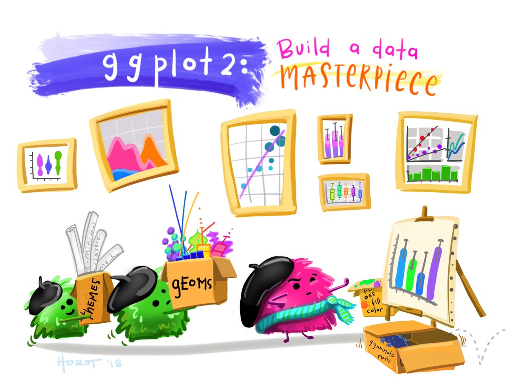
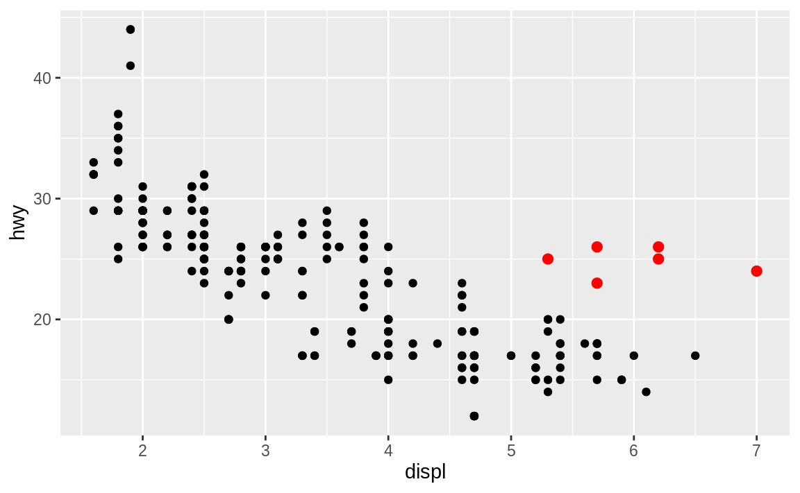
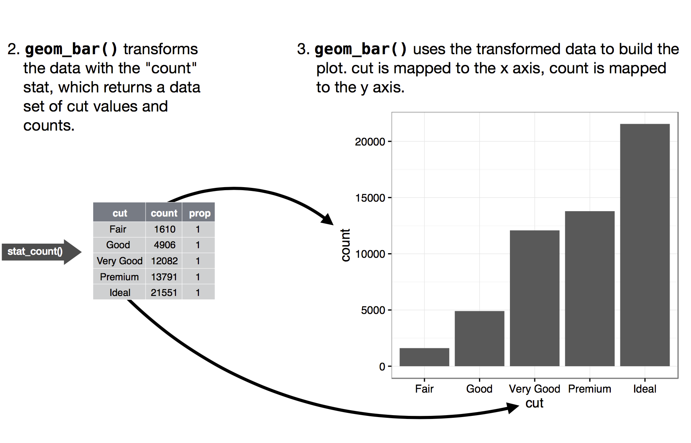

```{r setup, include=FALSE}
knitr::opts_chunk$set(echo = TRUE, out.height="150px", fig.align = 'center', message = FALSE, cache = TRUE)

library(egg)
library(tidyverse)

theme_update(
  legend.key.size = unit(3, "line"),        # legend symbols size
  legend.title = element_text(size = 20),   # legend labels
  legend.text = element_text(size = 18),    # legend text
  axis.title = element_text(size = 20),     # axis labels
  axis.text = element_text(size = 18),      # tick labels
  title = element_text(size = 22)           # title
)
```


## Introduction

- In lecture you will learn how to visualize data with the ggplot2 package.

- ggplot2 is one of the most elegant and versatile systems for making graphs.

- ggplot2 implements the grammar of graphics [@wickham2010layered], a coherent system for describing and building graphs.

## Prerequisites 

To access the datasets, help pages, and functions that we will use, load the ggplot2 package.

```{r, eval = FALSE}
library(ggplot2)
```

## The `mpg` dataset 

The `mpg` dataset contains information about 38 models of cars. Among the variables in mpg are: 
  
- `displ`: engine size, in liters

- `cyl`: number of cylinders

- `cty`: city miles per gallon

- `hwy`: fuel efficiency on the highway, in miles per gallon (mpg).

- `class`: type of car

```{r, eval = FALSE}
View(mpg)
```

For additional information see `?mpg`.

## My first `ggplot()`

Let’s build a graph to answer the following questions:
  
  - Do cars with big engines use more fuel than cars with small engines?
  
  - What does the relationship between engine size and fuel efficiency look like? Is it positive? Negative? Linear? Nonlinear?
  
  We start by plotting engine size (`displ`) versus fuel efficiency (`hwy`).

## My first `ggplot()`

```{r}
ggplot(data = mpg) +
  geom_point(mapping = aes(x = displ, y = hwy))
```

## My first `ggplot()`

- The plot shows a negative relationship between engine size and fuel efficiency.

- In other words: on average, cars with big engines use more fuel.

## A simple `ggplot()` template

```{r, eval = FALSE}
ggplot(data = <DATA>) + 
  <GEOM_FUNCTION>(mapping = aes(<MAPPINGS>))
```

- The first argument of `ggplot()` is a dataset

- We complete the graph by adding layers to `ggplot()`

- `geom_point()` adds a layer of points, creating scatterplot.

- ggplot2 has many geom functions that each add a different type of layer to a plot.

## A simple `ggplot()` template

- Each geom function takes a `mapping` argument. 

- The `mapping` argument is always paired with `aes()`. 

- The `x` and `y` arguments of `aes()` specify which variables to map to the `x` and `y` axes.

## Geometrical objects 

- A **geom** is the geometrical object that a plot uses to represent data (e.g. points, bars, lines...).

- People often describe plots by the type of **geom** that it uses:
  
  - Bar charts use **bar** geoms
  - Line charts use **line** geoms
  - Boxplots use **boxplot** geom
  - ... 

- Scatterplots break the trend: they use the **point** geom. 

- In ggplot2, we add geoms to a plot with **geom functions**.

## Geometrical objects 

Compare the next two plots. How are they similar?
  
```{r, eval = FALSE}
ggplot(data = mpg) + 
  geom_point(mapping = aes(x = displ, y = hwy))

ggplot(data = mpg) + 
  geom_smooth(mapping = aes(x = displ, y = hwy))
```

## Geometrical objects 

```{r, echo = FALSE, fig.width=15, fig.fullwidth=TRUE}
left <- ggplot(data = mpg) + 
  geom_point(mapping = aes(x = displ, y = hwy))

right <- ggplot(data = mpg) + 
  geom_smooth(mapping = aes(x = displ, y = hwy))

ggarrange(left, right, nrow = 1)
```

## Geometrical objects 

Both plots:
  
  - use the same data

- have the same `x` variable

- have the same `y` variable

But they are not identical:
  
  - Each plot uses a different **geom**. 

- The plot on the left uses the **point** geom.

- The plot on the right uses the **smooth** geom, a smooth line fitted to the data.

## The ggplot2 cheat sheet

- ggplot2 provides over 40 geoms
- The best way to get a comprehensive overview is the [ggplot2 cheatsheet](https://rstudio.com/wp-content/uploads/2016/11/ggplot2-cheatsheet-2.1.pdf).

## Aesthetics

- **Aesthetics** are visual properties of the **geoms**.

- **Aesthetics** include things like the size, shape, and color of the points in a scatterplot.

- `aes()` builds **aesthetic mappings** that define how the variables in the dataset are mapped to aesthetics of the geoms. 

- To map an aesthetic to a variable, associate the name of the aesthetic to the name of the variable inside `aes()`.

- Every geom function needs an aesthetic mapping, but not every aesthetic works with every geom, for example:
  
  - We can set the `shape` of a point, but not of a line. 
  - We can set the `linetype` of a line, but not of a point.

## My first `ggplot()` revisited

One group of points (highlighted in red) seems to fall outside the linear trend. How can we explain these cars?
  
  {width=300px}

## My first `ggplot()` revisited

- The highlighted cars may have some common characteristic with respect to some other variable (e.g. they might all be hybrids).

- Lets try `class`, a variable that classifies cars into groups such as compact, midsize, and SUV.

- We can add a third variable to a two dimensional scatterplot by mapping it to an aesthetic.

## The color aesthetic

For example, we can map the color of the points to the `class` variable, so that the graph reveals the class of each car:

```{r, eval = FALSE}
ggplot(data = mpg) +
  geom_point(aes(x = displ, y = hwy, color = class))
```

## The color aesthetic

```{r, echo = FALSE, out.height="200px"}
ggplot(data = mpg) +
  geom_point(mapping = aes(x = displ, y = hwy, color = class))
```

## The color aesthetic

Now we know that all but one of the highlighted cars are two-seater cars! Let's find their model and manufacturer:

```{r}
subset(mpg, class == "2seater", 
       select = c("manufacturer", "model", "year"))
```

## The color aesthetic

- These cars are, in fact, sports cars!

- Sports cars have large engines like SUVs and pickup trucks, but small bodies like midsize and compact cars, which improves their gas mileage. 

{width=250px}

## The size aesthetic

Now let´s map `class` to the size aesthetic:

```{r, eval = FALSE}
ggplot(data = mpg) +
  geom_point(aes(x = displ, y = hwy, size = class))
```

## The size aesthetic

```{r, echo = FALSE, warning = FALSE, out.height="200px"}
ggplot(data = mpg) +
  geom_point(aes(x = displ, y = hwy, size = class))
```

## The size aesthetic

- Each level of the `class` variable is assigned to a different size.

- This plot, however, came with a warning message:

```{r}
#> Using size for a discrete variable is not advised.
```

- This is because mapping an unordered variable (`class`) to ordered aesthetic (`size`) is not a good idea.

- Ordered aesthetics, like `size` and `alpha`, are more appropriate for continuous variables.

## The alpha aesthetic

The `alpha` aesthetic changes the transparency of the points:

```{r, eval = FALSE}
ggplot(data = mpg) +
  geom_point(aes(x = displ, y = hwy, alpha = class))
```

## The alpha aesthetic

```{r, echo = FALSE, warning = FALSE, out.height = "200px"}
ggplot(data = mpg) +
  geom_point(aes(x = displ, y = hwy, alpha = class))
```

## The shape aesthetic

The `shape` aesthetic changes the shape of the points:

```{r, eval = FALSE}
ggplot(data = mpg) +
  geom_point(aes(x = displ, y = hwy, shape = class))
```

## The shape aesthetic

```{r, echo = FALSE, warning=FALSE, out.height = "200px"}
ggplot(data = mpg) +
  geom_point(aes(x = displ, y = hwy, shape = class))
```

## The shape aesthetic

- What happened to the SUVs? 

- By default ggplot2 uses only up to six shapes at a time.

- This is because points become difficult to discriminate if we use too many shapes.

- We can, however, use more than six shapes if we set them "manually" with `scale_shape_manual()`.

## The shape aesthetic

We can choose the following shapes of points by their number:

{width=200px}

## The shape aesthetic

Let's choose the first 7 shapes:
  
```{r, eval = FALSE}
ggplot(data = mpg) +
  geom_point(aes(x = displ, y = hwy, shape = class)) +
  scale_shape_manual(values = 0:6)
```

## The shape aesthetic

```{r, echo = FALSE, warning=FALSE, out.height = "200px"}
ggplot(data = mpg) +
  geom_point(aes(x = displ, y = hwy, shape = class)) +
  scale_shape_manual(values = 0:6)
```

## Mapping one variable to two aesthetics

- Mapping a single variable to multiple aesthetics is redundant, and should be avoided in most cases.

- In this case, however, since we have many categories, it can improving visual discrimination.

- Let´s map `class` to `color` and `shape`:
  
```{r, eval = FALSE}
ggplot(data = mpg) +
  geom_point(aes(x = displ, y = hwy, 
                 shape = class, color = class)) +
  scale_shape_manual(values = 1:7)
```

## Mapping one variable to two aesthetics

```{r, echo = FALSE, warning=FALSE, out.height = "200px"}
ggplot(data = mpg) +
  geom_point(
    mapping = aes(x = displ, y = hwy,
                  shape = class, color = class)) +
  scale_shape_manual(values = 1:7)
```

## Mapping continuous variables to aesthetics

- So far we mapped `class`, a categorical variable, to the `color`, `size`, `shape` and `alpha` aesthetics of `geom_point()`.

- Now let´s map continuous variables to these aesthetics and see how they behaves differently for categorical versus continuous variables.

- The variable `cty` (city miles per gallon) is a continuous variable. 

## Mapping continuous variables to aesthetics

Let's map `cty` to the `color` aesthetic:

```{r, eval = FALSE}
ggplot(mpg) +
  geom_point(aes(x = displ,y = hwy, color = cty))
```

## Mapping continuous variables to aesthetics

```{r, echo = FALSE, out.height = "200px"}
ggplot(mpg) +
  geom_point(aes(x = displ, y = hwy, color = cty))
```

## Mapping continuous variables to aesthetics

Now let's map `cty` to the `size` aesthetic:
  
```{r, eval=FALSE}
ggplot(mpg) + 
  geom_point(aes(x = displ, y = hwy, size = cty))
```

## Mapping continuous variables to aesthetics

```{r, echo = FALSE, out.height = "200px"}
ggplot(mpg) + 
  geom_point(aes(x = displ, y = hwy, size = cty))
```

## Mapping continuous variables to aesthetics

Now let's map `cty` to the `alpha` aesthetic:

```{r, eval=FALSE}
ggplot(mpg) + 
  geom_point(aes(x = displ, y = hwy, alpha = cty)) 
```

## Mapping continuous variables to aesthetics

```{r, echo = FALSE, out.height = "200px"}
ggplot(mpg) + 
  geom_point(aes(x = displ, y = hwy, alpha = cty)) 
```

## Mapping continuous variables to aesthetics

And finally let's map `cty` to the `shape` aesthetic:
  
```{r, eval=FALSE}
ggplot(mpg) + 
  geom_point(aes(x = displ, y = hwy, shape = cty))     

#> Error: A continuous variable can not be mapped to 
#> shape
```

## Aesthetic mappings: categorical vs continuous variables

**Color** and **alpha** aesthetics:
  
  - Each level of a categorical variable is assigned to a different (discrete) color.

  - The color of the points vary continuously from light to dark as a function of the values of a continuous variables.

**Size** aesthetic:
  
  - Each level of a categorical variable is assigned to a different (discrete) size.

  - The size of the points vary continuously as a function of the values of a continuous variables.

## Aesthetic mappings: categorical vs continuous variables

**Shape** aesthetic:
  
  - A different shape is assigned to each level of a categorical value.

  - The shape aesthetic can not be mapped to continuous variables.

## The `linetype` aesthetic 

`geom_smooth()` draws a different type of line for each level of the variable that is mapped to the `linetype` aesthetic:
  
```{r, eval=FALSE}
ggplot(data = mpg) + 
  geom_smooth(aes(x = displ, y = hwy, linetype = drv))
```

## The `linetype` aesthetic 

```{r, echo=FALSE, out.height="200px"}
ggplot(data = mpg) + 
  geom_smooth(aes(x = displ, y = hwy, linetype = drv))
```

## The `linetype` aesthetic 

- The `linetype` aesthetic automatically adds a legend.
- The `linetype` aesthetic can not be mapped to continuous variables.

## The `group` aesthetic 

- The `group` aesthetic also draws a separate object for each level of a discrete variable.

- The `group` aesthetic does not add a legend or any other distinguishing feature.

## The `group` aesthetic 

```{r, eval = FALSE}
p1 <- ggplot(data = mpg) +
  geom_smooth(aes(x = displ, y = hwy))

p2 <- ggplot(data = mpg) +
  geom_smooth(aes(x = displ, y = hwy, group = drv))
```

## The `group` aesthetic 

```{r, echo = FALSE, fig.width=15, fig.fullwidth=TRUE}
p1 <- ggplot(data = mpg) +
  geom_smooth(aes(x = displ, y = hwy))

p2 <- ggplot(data = mpg) +
  geom_smooth(aes(x = displ, y = hwy, group = drv))

ggarrange(p1, p2, nrow = 1)
```

## `group` vs `linetype`

```{r, eval = FALSE}
ggplot(data = mpg) +
  geom_smooth(aes(x = displ, y = hwy, group = drv))

ggplot(data = mpg) +
  geom_smooth(aes(x = displ, y = hwy, linetype = drv))
```

## `group` vs `linetype`

```{r, echo = FALSE, fig.width=15, fig.fullwidth=TRUE}
left <- ggplot(data = mpg) +
  geom_smooth(aes(x = displ, y = hwy, group = drv))

right <- ggplot(data = mpg) +
  geom_smooth(aes(x = displ, y = hwy, linetype = drv))

ggarrange(left, right, nrow = 1)
```

## `group` vs `color`

```{r, eval = FALSE}
ggplot(data = mpg) +
  geom_smooth(aes(x = displ, y = hwy, group = drv))

ggplot(data = mpg) +
  geom_smooth(aes(x = displ, y = hwy, color = drv))
```

## `group` vs `color`

```{r, echo = FALSE, fig.width=15, fig.fullwidth=TRUE}
left <- ggplot(data = mpg) +
  geom_smooth(aes(x = displ, y = hwy, group = drv))

right <- ggplot(data = mpg) +
  geom_smooth(aes(x = displ, y = hwy, color = drv))

ggarrange(left, right, nrow = 1)
```

## Aesthetics and logical conditions

Aesthetics can be mapped to logical expressions. For example, if we map an aesthetic to `displ < 5`:
  
- `ggplot()` creates a temporary variable with values equal to the result `displ < 5`.

- The result of `displ < 5` is a logical variable.

- `ggplot()` then maps the aesthetic to the temporary variable.

## Aesthetics and logical conditions

```{r}
ggplot(mpg) + 
  geom_point(aes(x = displ, y = hwy, 
                 color = displ < 5))
```

## Aesthetics and logical conditions

```{r}
ggplot(mpg) + 
  geom_point(aes(x = displ, y = hwy, 
                 color = class == "2seater"))
```

## Changing default aesthetic properties of geoms

- To change a default aesthetic property, set the aesthetic by name as an argument of the geom function.
  
  - Names of colors should be indicated as character strings.

  - Size of points should be indicated in mm.
  
  - Shapes are identified by the numbers in figure 3.

## Changing default aesthetic properties of geoms

- There are some seeming duplicate shapes (e.g. 0, 15, and 22 are all squares).

- The difference comes from the interaction of the `color` and `fill` aesthetics:
  
  - The hollow shapes (0–14) have a border determined by the `color` aesthetic

  - The solid shapes (15–18) are filled with the color `aesthetic`

  - The filled shapes (21–24) have a border set by the `color` aesthetic and are filled with the `fill` aesthetic
  
## Changing default aesthetic properties of geoms

For example, we can make all of the points blue:
  
```{r, eval = FALSE}
ggplot(data = mpg) +
  geom_point(aes(x = displ, y = hwy), 
    color = "blue")
```

## Changing default aesthetic properties of geoms

```{r, echo = FALSE, out.height = "200px"}
ggplot(data = mpg) + 
  geom_point(aes(x = displ, y = hwy),
             color = "blue")
```

## Changing default aesthetic properties of geoms

Now let's change the size of the points:

```{r, eval = FALSE}
ggplot(data = mpg) +
  geom_point(aes(x = displ, y = hwy), 
    color = "blue",
    size = 6)
```

## Changing default aesthetic properties of geoms

```{r, echo = FALSE, out.height = "200px"}
ggplot(data = mpg) +
  geom_point(aes(x = displ, y = hwy), 
    color = "blue",
    size = 6)
```

## Changing default aesthetic properties of geoms

We can also change the default shape of the points:

```{r, eval = FALSE}
ggplot(data = mpg) + 
  geom_point(aes(x = displ, y = hwy), 
    color = "blue",
    size = 5,
    shape = 6)
```

## Changing default aesthetic properties of geoms

```{r, echo = FALSE, out.height = "200px"}
ggplot(data = mpg) + 
  geom_point(aes(x = displ, y = hwy), 
             color = "blue", size = 5, shape = 6)
```

## Changing default aesthetic properties of geoms

- Shape 6 is a hollow shape, it interacts only with the `color` aesthetic. 

- If we want triangles filled with color, we must use shape 24, which interacts both with the color and `fill` aesthetics:

```{r, eval = FALSE}
ggplot(data = mpg) +
  geom_point(
    mapping = aes(x = displ, y = hwy),
    color = "blue",
    size = 5,
    shape = 24,
    fill = "red"
  )
```

## Changing default aesthetic properties of geoms

```{r, echo = FALSE, out.height = "200px"}
ggplot(data = mpg) +
  geom_point(mapping = aes(x = displ, y = hwy),
    color = "blue", size = 5, shape = 24, fill = "red")
```

## Changing default aesthetic properties of geoms

The `stroke` aesthetic changes the thickness of the border of the points:

```{r, eval = FALSE}
ggplot(data = mpg) +
  geom_point(aes(x = displ, y = hwy),
    color = "blue",
    size = 5,
    shape = 23,
    fill = "red",
    stroke = 2
  )
```

## Changing default aesthetic properties of geoms

```{r, echo = FALSE, out.height = "200px"}
ggplot(data = mpg) +
  geom_point(aes(x = displ, y = hwy), 
             color = "blue", size = 5, shape = 23, fill = "red", stroke = 2
  )
```

## Changing default aesthetic properties of geoms

We can also use colors like dark blue and light blue:

```{r, eval=FALSE}
ggplot(data = mpg) +
  geom_point(aes(x = displ, y = hwy),
    color = "darkblue",
    fill = "lightblue",
    shape = 21,
    size = 5,
    stroke = 1
  )
```

## Changing default aesthetic properties of geoms

```{r, echo = FALSE, out.height = "200px"}
ggplot(data = mpg) +
  geom_point(aes(x = displ, y = hwy),
    color = "darkblue",
    fill = "lightblue",
    shape = 21,
    size = 5,
    stroke = 1
  )
```

## Changing default aesthetic properties of geoms

```{r, eval=FALSE}
ggplot(data = mpg) +
  geom_point(aes(x = displ, y = hwy),
    color = "darkblue",
    fill = "lightblue",
    shape = 21,
    size = 5,
    stroke = 3
  )
```

## Changing default aesthetic properties of geoms

```{r, echo = FALSE, out.height = "200px"}
ggplot(data = mpg) +
  geom_point(aes(x = displ, y = hwy),
    color = "darkblue",
    fill = "lightblue",
    shape = 21,
    size = 5,
    stroke = 3
  )
```

## Changing default aesthetic properties of geoms

- For a list of available colors and their names see: [http://sape.inf.usi.ch/quick-reference/ggplot2/color](http://sape.inf.usi.ch/quick-reference/ggplot2/color)

## Changing default aesthetic properties of geoms

- Alternatively, we can use RGB codes.

- The RGB model reproduces a broad array of colors by mixing together red, green, and blue in different proportions.

- We can specify colors like in HTML/CSS, using the hexadecimal values (00 to FF) for red, green, and blue, concatenated into a string, prefixed with a "#". 

- A pure red color this is represented with "#FF0000".

See:

- [https://www.rapidtables.com/web/color/RGB_Color.html](https://www.rapidtables.com/web/color/RGB_Color.html)
- [https://htmlcolorcodes.com](https://htmlcolorcodes.com)

## Changing default aesthetic properties of geoms

We can change the default line type of geom functions like `geom_smooth()`. 

{width=250px}

## Changing default aesthetic properties of geoms

```{r, eval = FALSE}
ggplot(data = mpg) + 
  geom_smooth(aes(x = displ, y = hwy))

ggplot(data = mpg) + 
  geom_smooth(aes(x = displ, y = hwy),
    linetype = "dotted")

ggplot(data = mpg) + 
  geom_smooth(aes(x = displ, y = hwy),
    linetype = "twodash")
```

## Changing default aesthetic properties of geoms

```{r, echo = FALSE, fig.width=15}
left <- ggplot(data = mpg) + 
  geom_smooth(aes(x = displ, y = hwy))

center <- ggplot(data = mpg) + 
  geom_smooth(aes(x = displ, y = hwy),
    linetype = "dotted")

right <- ggplot(data = mpg) + 
  geom_smooth(aes(x = displ, y = hwy),
    linetype = "twodash")

ggarrange(left, center, right, nrow = 1)
```

## Changing default aesthetic properties of geoms

We can also change the thickness of the lines:

```{r,eval=FALSE}
ggplot(data = mpg) + 
  geom_smooth(aes(x = displ, y = hwy))

ggplot(data = mpg) + 
  geom_smooth(aes(x = displ, y = hwy), size = 2)

ggplot(data = mpg) + 
  geom_smooth(aes(x = displ, y = hwy), size = 5)
```

## Changing default aesthetic properties of geoms

```{r, echo = FALSE, fig.width=15}
left <- ggplot(data = mpg) + 
  geom_smooth(aes(x = displ, y = hwy))

center <- ggplot(data = mpg) + 
  geom_smooth(aes(x = displ, y = hwy),size = 2)

right <- ggplot(data = mpg) + 
  geom_smooth(aes(x = displ, y = hwy), size = 5)

ggarrange(left, center, right, nrow = 1)
```

## Changing default aesthetic properties of geoms

```{r, eval = FALSE}
ggplot(data = mpg) + 
  geom_smooth(aes(x = displ, y = hwy),
              linetype = "dotted")

ggplot(data = mpg) + 
  geom_smooth(aes(x = displ, y = hwy),
              linetype = "dotted", size = 2)

ggplot(data = mpg) + 
  geom_smooth(aes(x = displ, y = hwy),
              linetype = "dotted", size = 5)

```

## Changing default aesthetic properties of geoms

```{r, echo = FALSE, fig.width=15}
left <- ggplot(data = mpg) + 
  geom_smooth(aes(x = displ, y = hwy),
              linetype = "dotted")

center <- ggplot(data = mpg) + 
  geom_smooth(aes(x = displ, y = hwy),
              linetype = "dotted", size = 2)

right <- ggplot(data = mpg) + 
  geom_smooth(aes(x = displ, y = hwy),
              linetype = "dotted", size = 5)

ggarrange(left, center, right, nrow = 1)
```

## Changing default aesthetic properties of geoms

- By default, `geom_smooth()` displays confidence intervals around the smoothed line.
- Confidence intervals may be disabled by setting the `se` (standard error) aesthetic to `FALSE`:

```{r, eval = FALSE}
ggplot(data = mpg) +
  geom_smooth(aes(x = displ, y = hwy))

ggplot(data = mpg) +
  geom_smooth(aes(x = displ, y = hwy),
    se = FALSE)
```

## Changing default aesthetic properties of geoms

```{r, echo = FALSE, fig.width=15}

left <- ggplot(data = mpg) +
  geom_smooth(aes(x = displ, y = hwy))

right <- ggplot(data = mpg) +
  geom_smooth(aes(x = displ, y = hwy),
    se = FALSE)

ggarrange(left, right, nrow = 1)
```

## Changing default aesthetic properties of geoms

```{r, eval = FALSE}
ggplot(data = mpg) +
  geom_smooth(aes(x = displ, y = hwy, linetype = drv))

ggplot(data = mpg) +
  geom_smooth(aes(x = displ, y = hwy, linetype = drv),
    se = FALSE)
```

## Changing default aesthetic properties of geoms

```{r, echo = FALSE, fig.width=15}
left <- ggplot(data = mpg) +
  geom_smooth(aes(x = displ, y = hwy, linetype = drv))

right <- ggplot(data = mpg) +
  geom_smooth(aes(x = displ, y = hwy, linetype = drv),
    se = FALSE)

ggarrange(left, right, nrow = 1)
```

## Changing default aesthetic properties of geoms

```{r,eval=FALSE}
ggplot(data = mpg) + 
  geom_smooth(aes(x = displ, y = hwy, color = drv))

ggplot(data = mpg) + 
  geom_smooth(aes(x = displ, y = hwy, color = drv),
    se = FALSE)
```

## Changing default aesthetic properties of geoms

```{r, echo = FALSE, fig.width=15}
l <- ggplot(data = mpg) + 
  geom_smooth(aes(x = displ, y = hwy, color = drv))
  
r <- ggplot(data = mpg) + 
  geom_smooth(aes(x = displ, y = hwy, color = drv),
    se = FALSE)

ggarrange(l, r, nrow = 1)
```

## Changing default aesthetic properties of geoms

- The default smoothing method of `geom_smooth` can be changed.

- The default method (`"auto"`) depends on the size of the largest group.

- For less than 1000 observations the method is `"loess"` (a local polynomial regression).

- Admissible methods are: `"auto"`, `"lm"`, `"glm"`, `"gam"` and `"loess"`. 

## Changing default aesthetic properties of geoms 

To add a linear regression line use `method = "lm"`:

```{r, eval = FALSE}
ggplot(data = mpg) + 
  geom_point(aes(x = displ, y = hwy))

ggplot(data = mpg) + 
  geom_smooth(aes(x = displ, y = hwy))

ggplot(data = mpg) + 
  geom_smooth(aes(x = displ, y = hwy), method = "lm")
```

## Changing default aesthetic properties of geoms 

```{r, echo = FALSE, fig.width=15}
l <- ggplot(data = mpg) + 
  geom_point(aes(x = displ, y = hwy))

c <- ggplot(data = mpg) + 
  geom_smooth(aes(x = displ, y = hwy))

r <- ggplot(data = mpg) + 
  geom_smooth(aes(x = displ, y = hwy), method = "lm")

ggarrange(l, c, r, nrow = 1)
```


## Changing default aesthetic properties of geoms

Legends can also be disabled: 

```{r,eval=FALSE}
ggplot(data = mpg) + 
  geom_smooth(aes(x = displ, y = hwy, linetype = drv),
    se = FALSE)

ggplot(data = mpg) + 
  geom_smooth(aes(x = displ, y = hwy, linetype = drv),
    se = FALSE, show.legend = FALSE)
```

## Changing default aesthetic properties of geoms

```{r, echo = FALSE, fig.width=15}
l <- ggplot(data = mpg) + 
  geom_smooth(aes(x = displ, y = hwy, linetype = drv),
    se = FALSE)

r <- ggplot(data = mpg) + 
  geom_smooth(aes(x = displ, y = hwy, linetype = drv),
    se = FALSE, show.legend = FALSE)

ggarrange(l, r, nrow = 1)
```

## Changing default aesthetic properties of geoms

```{r,eval=FALSE}
ggplot(data = mpg) + 
  geom_smooth(aes(x = displ, y = hwy, color = drv),
    se = FALSE)

ggplot(data = mpg) + 
  geom_smooth(aes(x = displ, y = hwy, color = drv),
    se = FALSE, show.legend = FALSE)
```

## Changing default aesthetic properties of geoms

```{r, echo = FALSE, fig.width=15}
l <- ggplot(data = mpg) + 
  geom_smooth(aes(x = displ, y = hwy, color = drv),
    se = FALSE)

r <- ggplot(data = mpg) + 
  geom_smooth(aes(x = displ, y = hwy, color = drv),
    se = FALSE, show.legend = FALSE)

ggarrange(l, r, nrow = 1)
```

## Facets

- One way to add additional variables to a plot is with **aesthetics**. 

- Another way, particularly useful for categorical variables, is to split the plot into **facets**, subplots that each display one subset of the data.

- To facet a plot by a single variable, use `facet_wrap()`.

- The first argument of `facet_wrap()` should be `"~`" followed the name of a variable.

## Facets

```{r, eval = FALSE}
ggplot(data = mpg) + 
  geom_point(aes(x = displ, y = hwy)) + 
  facet_wrap(~ class, nrow = 2)
```

## Facets

```{r, echo = FALSE, out.height = "200px"}
ggplot(data = mpg) + 
  geom_point(aes(x = displ, y = hwy)) + 
  facet_wrap(~ class, nrow = 2) +
  theme(strip.text = element_text(size=20),
        strip.background = element_rect(size=1))

```

## Facets

```{r, eval = FALSE}
ggplot(data = mpg) + 
  geom_smooth(aes(x = displ, y = cyl), se = FALSE) + 
  facet_wrap(~class, nrow = 2)
```

## Facets

```{r, echo = FALSE, warning=FALSE, out.height = "200px"}
ggplot(data = mpg) + 
  geom_smooth(aes(x = displ, y = cyl), se = FALSE) + 
  facet_wrap(~class, nrow = 2) +
  theme(strip.text = element_text(size=20),
        strip.background = element_rect(size=1))
```

## Facets

- To facet a plot on the combination of two variables, use `facet_grid()`.

- The first argument of `facet_grid()` should contain the two variable names separated by `"~"`.

```{r, eval = FALSE}
ggplot(data = mpg) + 
  geom_point(aes(x = displ, y = hwy)) + 
  facet_grid(drv ~ cyl)
```

## Facets

```{r, echo = FALSE, out.height = "200px"}
ggplot(data = mpg) + 
  geom_point(aes(x = displ, y = hwy)) + 
  facet_grid(drv ~ cyl) +
  theme(strip.text = element_text(size=20),
        strip.background = element_rect(size=1))
```

## Facets

If we prefer to not facet in the rows (or columns), we can use a `"."` instead of a variable name: 

```{r, eval = FALSE}
ggplot(data = mpg) + 
  geom_point(aes(x = displ, y = hwy)) + 
  facet_grid(. ~ cyl)
```

## Facets

```{r, echo = FALSE, out.height = "200px"}
ggplot(data = mpg) + 
  geom_point(aes(x = displ, y = hwy)) + 
  facet_grid(. ~ cyl) +
  theme(strip.text = element_text(size=20),
        strip.background = element_rect(size=1))
```

## Facets

```{r, eval = FALSE}
ggplot(data = mpg) + 
  geom_point(aes(x = displ, y = hwy)) +
  facet_grid(drv ~ .)
```

## Facets

```{r, echo = FALSE, out.height = "200px"}
ggplot(data = mpg) + 
  geom_point(aes(x = displ, y = hwy)) +
  facet_grid(drv ~ .) +
  theme(strip.text = element_text(size=20),
        strip.background = element_rect(size=1))
```

<!-- ## Facets -->

<!-- What happens if we facet on a continuous variable, like `cty`? The continuous variable is converted to a categorical variable, and the plot contains a facet for each distinct value. -->

<!-- ```{r, eval = FALSE} -->
<!-- mpg_shorter_cty <- subset(mpg, cty %in% 9:13) -->

<!-- ggplot(subset(mpg_shorter_cty, cty %in% 9:13)) + -->
<!--   geom_point(aes(x = displ, y = hwy)) + -->
<!--   facet_grid(. ~ cty) -->
<!-- ``` -->

<!-- ## Facets -->

<!-- ```{r, echo = FALSE, out.height = "200px"} -->
<!-- mpg_shorter_cty <- subset(mpg, cty %in% 9:13) -->

<!-- ggplot(subset(mpg_shorter_cty, cty %in% 9:13)) + -->
<!--   geom_point(aes(x = displ, y = hwy)) + -->
<!--   facet_grid(. ~ cty) -->
<!-- ``` -->

<!-- ## Facets -->

<!-- Now with the full dataset: -->

<!-- ```{r, eval = FALSE} -->
<!-- ggplot(mpg) + -->
<!--   geom_point(aes(x = displ, y = hwy)) + -->
<!--   facet_grid(. ~ cty) -->
<!-- ``` -->

<!-- ## Facets -->

<!-- ```{r, echo = FALSE, out.height = "200px"} -->
<!-- ggplot(mpg) + -->
<!--   geom_point(aes(x = displ, y = hwy)) + -->
<!--   facet_grid(. ~ cty) -->
<!-- ``` -->

## Multiple geoms

- We can add multiple geoms to the same graph.

- For example, we can overlap points and lines.

- This is archived by adding multiple geom functions to `ggplot()`.

## Multiple geoms

```{r}
ggplot(data = mpg) + 
  geom_point(aes(x = displ, y = hwy)) +
  geom_smooth(aes(x = displ, y = hwy))
```

## Multiple geoms

```{r, eval = FALSE}
ggplot(data = mpg) +
  geom_smooth(aes(x = displ, y = hwy), se = FALSE) +
  geom_point(aes(x = displ, y = hwy))
              
ggplot(data = mpg) +
  geom_smooth(aes(x = displ, y = hwy, group = drv), 
              se = FALSE) +
  geom_point(aes(x = displ, y = hwy))
```

## Multiple geoms

```{r, echo = FALSE, fig.width=15}
p1 <- ggplot(data = mpg) +
  geom_smooth( mapping = aes(x = displ, y = hwy),
    se = FALSE) +
  geom_point(mapping = aes(x = displ, y = hwy))
              
p2 <- ggplot(data = mpg) +
  geom_smooth(mapping = aes(x = displ, y = hwy,
                            group = drv), 
    se = FALSE) +
  geom_point(mapping = aes(x = displ, y = hwy))
              
ggarrange(p1, p2, nrow = 1)
```

## Multiple geoms

- This, however, induces duplication in our code.

- We built the same aesthetic mapping twice in each graph.

- We can avoid this type of repetition by passing a set of mappings to `ggplot()`.

- ggplot2 will treat these mappings as global mappings that apply to each geom in the graph.

## Multiple geoms

These two chunks of code result in the same plot:

```{r, eval = FALSE}
ggplot(data = mpg) + 
  geom_point(aes(x = displ, y = hwy)) +
  geom_smooth(aes(x = displ, y = hwy))
```

```{r, eval= FALSE}
ggplot(data = mpg, aes(x = displ, y = hwy)) + 
  geom_point() + 
  geom_smooth()
```

## Multiple geoms

```{r, echo = FALSE, out.height="200px"}
ggplot(data = mpg, aes(x = displ, y = hwy)) + 
  geom_point() + 
  geom_smooth()
```

## Multiple geoms

- If we place mappings in a geom function, ggplot2 will treat them as local mappings for that layer. 

- It will use these mappings to extend or overwrite the global mappings for that layer only. 

- This makes it possible to display different aesthetics in different layers.

## Multiple geoms

```{r, eval = FALSE}
ggplot(data = mpg, aes(x = displ, y = hwy)) + 
  geom_smooth(aes(color = drv), se = FALSE) +
  geom_point()
```

## Multiple geoms

```{r, echo = FALSE, warning = FALSE, out.height = "200px"}
ggplot(data = mpg, aes(x = displ, y = hwy)) + 
  geom_smooth(aes(color = drv), se = FALSE) +
  geom_point()
```

## Multiple geoms

```{r, eval = FALSE}
ggplot(data = mpg, 
       aes(x = displ, y = hwy, color = drv)) + 
  geom_smooth(se = FALSE) +
  geom_point()
```

## Multiple geoms

```{r, echo = FALSE, warning = FALSE, out.height = "200px"}
ggplot(data = mpg, aes(x = displ, y = hwy, color = drv)) + 
  geom_smooth(se = FALSE) +
  geom_point()
```


## Multiple geoms

```{r, eval = FALSE}
ggplot(data = mpg, aes(x = displ, y = hwy)) +
   geom_smooth(aes(linetype = drv), se = FALSE) +
   geom_point(aes(color = drv))
```

## Multiple geoms

```{r, echo = FALSE, out.height = "200px"}
ggplot(data = mpg, aes(x = displ, y = hwy)) +
  geom_smooth(aes(linetype = drv), se = FALSE) +
  geom_point(aes(color = drv))
```

## Multiple geoms

```{r, eval = FALSE}
ggplot(data = mpg, aes(x = displ, y = hwy, 
                       color = drv)) +
  geom_smooth(aes(linetype = drv), se = FALSE) +
  geom_point()
```

## Multiple geoms

```{r, echo = FALSE, out.height = "200px"}
ggplot(data = mpg, aes(x = displ, y = hwy,
                       color = drv)) + 
  geom_smooth(aes(linetype = drv), se = FALSE) + 
  geom_point() 
```

<!-- ## Multiple geoms -->

<!-- ```{r, eval = FALSE} -->
<!-- ggplot(data = mpg, aes(x = displ, y = hwy)) +  -->
<!--   geom_smooth(aes(linetype = drv)) + -->
<!--   geom_point(aes(color = drv)) -->
<!-- ``` -->

<!-- ## Multiple geoms -->

<!-- ```{r, echo = FALSE, warning = FALSE, out.height = "200px"} -->
<!-- ggplot(data = mpg, aes(x = displ, y = hwy)) +  -->
<!--   geom_smooth(aes(linetype = drv)) + -->
<!--   geom_point(aes(color = drv)) -->
<!-- ``` -->

## Multiple geoms

```{r, eval = FALSE}
ggplot(data = mpg, aes(x = displ, y = hwy)) + 
  geom_point(aes(color = class)) + 
  geom_smooth()
```

## Multiple geoms

```{r, echo = FALSE, out.height="200px"}
ggplot(data = mpg, aes(x = displ, y = hwy)) + 
  geom_point(mapping = aes(color = class)) + 
  geom_smooth()
```

## Multiple geoms

```{r, eval = FALSE}
ggplot(data = mpg, aes(x = displ, y = hwy)) + 
  geom_smooth(aes(linetype = drv)) +
  geom_point(aes(color = class))
```

## Multiple geoms

```{r, echo = FALSE, warning = FALSE, out.height = "200px"}
ggplot(data = mpg, aes(x = displ, y = hwy)) + 
  geom_smooth(aes(linetype = drv)) +
  geom_point(aes(color = class))
```

## Multiple geoms

```{r, eval = FALSE}
ggplot(data = mpg, aes(x = displ, y = hwy)) + 
  geom_smooth(aes(linetype = drv), se = FALSE) +
  geom_point(aes(color = class))
```

## Multiple geoms

```{r, echo = FALSE, warning = FALSE, out.height = "200px"}
ggplot(data = mpg, aes(x = displ, y = hwy)) + 
  geom_smooth(aes(linetype = drv), se = FALSE) +
  geom_point(aes(color = class))
```

## Multiple geoms

We can also overlap geoms in grids:

```{r, eval = FALSE}
ggplot(data = mpg, aes(x = displ, y = hwy)) + 
  geom_smooth(se = FALSE) + 
  geom_point() + 
  facet_wrap(~class, nrow = 2)
```

## Multiple geoms

```{r, echo = FALSE, warning=FALSE, out.height = "200px"}
ggplot(data = mpg, aes(x = displ, y = hwy)) + 
  geom_smooth(se = FALSE) + 
  geom_point() + 
  facet_wrap(~class, nrow = 2) +
  theme(strip.text = element_text(size=20),
        strip.background = element_rect(size=1))
```

## Multiple geoms

```{r, eval = FALSE}
ggplot(data = mpg, aes(x = displ, y = hwy)) + 
  geom_point() + 
  geom_smooth(method = "lm", se = FALSE) + 
  facet_wrap(~class, nrow = 2)
```

## Multiple geoms

```{r, echo = FALSE, warning=FALSE, out.height = "200px"}
ggplot(data = mpg, aes(x = displ, y = hwy)) + 
  geom_point() + 
  geom_smooth(method = "lm", se = FALSE) +  
  facet_wrap(~class, nrow = 2) +
  theme(strip.text = element_text(size=20),
        strip.background = element_rect(size=1))
```

## Multiple geoms

- We can use the same logic to specify a different dataset for each layer. 

## Multiple geoms

```{r, eval = FALSE}
subcompact <- subset(mpg, class == "subcompact")

ggplot(data = mpg, aes(x = displ, y = hwy)) +
  geom_point(aes(color = class)) +
  geom_smooth(data = subcompact, se = FALSE, 
              method = "lm")
```

- The straight line displays just a subset of the mpg dataset, the subcompact cars. 

- The local data argument in geom_smooth() overrides the global data argument in `ggplot()` for that layer only.

## Multiple geoms

```{r, echo = FALSE, out.height="300px"}
subcompact <- subset(mpg, class == "subcompact")

ggplot(data = mpg, aes(x = displ, y = hwy)) +
  geom_point(aes(color = class)) +
  geom_smooth(data = subcompact, se = FALSE, 
              method = "lm")
```

## Multiple geoms

```{r, eval = FALSE}

subcompact <- subset(mpg, class == "subcompact")
two_seater <- subset(mpg, class == "2seater")

ggplot(data = mpg, aes(x = displ, y = hwy)) +
  geom_point(aes(color = class)) +
  geom_smooth(data = subcompact, se = FALSE,
              method = "lm") +
  geom_smooth(data = two_seater, se = FALSE,
              method = "lm")
```

## Multiple geoms

```{r, echo = FALSE, out.height="200px", warning=FALSE}

subcompact <- subset(mpg, class == "subcompact")
two_seater <- subset(mpg, class == "2seater")

ggplot(data = mpg, aes(x = displ, y = hwy)) +
  geom_point(aes(color = class)) +
  geom_smooth(data = subcompact, se = FALSE,
              method = "lm") +
  geom_smooth(data = two_seater, se = FALSE,
              method = "lm")
```

## Multiple geoms

```{r, eval = FALSE}
ggplot(data = mpg, aes(x = displ, y = hwy)) +
       geom_point(aes(color = class)) +
       geom_smooth(
         data = subset(mpg, class != "2seater"),
         se = FALSE,
         method = "lm")
```

## Multiple geoms

```{r, echo = FALSE, out.height="300px", warning=FALSE}
ggplot(data = mpg, aes(x = displ, y = hwy)) +
       geom_point(aes(color = class)) +
       geom_smooth(
         data = subset(mpg, class != "2seater"),
         se = FALSE,
         method = "lm")
```

## Multiple geoms

```{r, eval = FALSE}
corvette <- subset(mpg, model == "corvette")
not_corvette <- subset(mpg, model != "corvette")

ggplot(mapping = aes(x = displ, y = hwy)) + 
  geom_point(data = not_corvette) + 
  geom_point(data = corvette,  color = "Red")

```

## Multiple geoms

```{r, echo = FALSE, out.height="300px", warning=FALSE}
corvette <- subset(mpg, model == "corvette")
not_corvette <- subset(mpg, model != "corvette")

ggplot(mapping = aes(x = displ, y = hwy)) + 
  geom_point(data = not_corvette) + 
  geom_point(data = corvette,  color = "Red")
```

## Labels 

We can add labels to a graph with the `labs()` function:

```{r, eval = FALSE}
ggplot(mpg, aes(displ, hwy)) +
  geom_point(aes(color = class)) +
  geom_smooth(se = FALSE) +
  labs(
    title = "Efficiency decreases with engine size")

```

## Labels 

```{r, echo = FALSE, out.height="200px"}
ggplot(mpg, aes(displ, hwy)) +
  geom_point(aes(color = class)) +
  geom_smooth(se = FALSE) +
  labs(
    title = "Efficiency decreases with engine size"
    )
```

## Labels 

The `labs()` function can also be used to add a subtitle and/or a caption:

```{r, eval = FALSE}
ggplot(mpg, aes(displ, hwy)) +
  geom_point(aes(color = class)) +
  geom_smooth(se = FALSE) +
  labs(
    title = "Efficiency decreases with engine size",
    subtitle = "Two-seaters are an exception",
    caption = "Data from fueleconomy.gov"
  )
```

## Labels 

```{r, echo = FALSE, out.height="200px"}
ggplot(mpg, aes(displ, hwy)) +
  geom_point(aes(color = class)) +
  geom_smooth(se = FALSE) +
  labs(
    title = "Efficiency decreases with engine size",
    subtitle = "Two-seaters are an exception",
    caption = "Data from fueleconomy.gov"
  )
```

## Labels 

- We can also use labs() to replace the axis and legend titles.

- It’s usually a good idea to replace short variable names with more detailed descriptions, and to include the units.

## Labels 

```{r, eval = FALSE}
ggplot(mpg, aes(displ, hwy)) +
  geom_point(aes(color = class)) +
  geom_smooth(se = FALSE) +
  labs(
    x = "Engine displacement (L)",
    y = "Highway fuel economy (mpg)",
    color = "Car type"
  
```

## Labels 

```{r, echo = FALSE, out.height="200px"}
ggplot(mpg, aes(displ, hwy)) +
  geom_point(aes(color = class)) +
  geom_smooth(se = FALSE) +
  labs(
    x = "Engine displacement (L)",
    y = "Highway fuel economy (mpg)",
    color = "Car type"
  )
```

## Labels 

It’s possible to use mathematical equations instead of text strings:

```{r, eval = FALSE}
df <- tibble(
  x = runif(10),
  y = runif(10))

ggplot(df, aes(x, y)) +
  geom_point() +
  labs(
    x = quote(sum(x[i] ^ 2, i == 1, n)),
    y = quote(alpha + beta + frac(delta, theta))
  )
```

## Labels 

```{r, echo = FALSE, out.height="200px"}
df <- tibble(
  x = runif(10),
  y = runif(10))

ggplot(df, aes(x, y)) +
  geom_point() +
  labs(
    x = quote(sum(x[i] ^ 2, i == 1, n)),
    y = quote(alpha + beta + frac(delta, theta))
  )
```

## Labels 

To learn more about the mathematical syntax available see:

```{r}
?plotmath
```

## The `diamonds` dataset

- Diamonds is a dataset included in the ggplot2 package.

- Contains attributes of almost 54000 diamonds. 

- The variables include price, carat, quality of the cut, color and clarity

## Bar charts

```{r}
ggplot(data = diamonds) + 
  geom_bar(aes(x = cut))
```

## Statistical transformations

- On the y-axis, bar charts displays counts.

- But counts are not a variable in diamonds dataset!

- Many graphs, like scatterplots, plot the raw values the dataset. 

- Other graphs, like bar charts, calculate new values to plot.

- The algorithm used to calculate new values for a graph is called a **stat**, short for statistical transformation.

## Statistical transformations

- Bar charts, histograms, and frequency polygons bin the data and then plot bin counts.

- Smoothers fit a model to the data and then plot predictions from the model.

- Boxplots compute summary statistics and then display them on specially formatted box.

## Statistical transformations

{width=300px}

## Statistical transformations

{width=400px}

## Statistical transformations

- We can learn which stat a geom function uses by inspecting the default value of the `stat` argument. 

- For example, with `?geom_bar` we learn that the default `stat` of `geom_bar()` is `count`.

- This means that `geom_bar()` uses `stat_count()` as the default statistical transformation.

- We can generally use geoms and stats interchangeably. 

- For example, we can recreate the previous plot using `stat_count()` instead of `geom_bar()`.
 
## Statistical transformations

```{r}
ggplot(data = diamonds) + 
  stat_count(aes(x = cut))
```

## Statistical transformations

This works because:

- Every geom has a default stat, and every stat has a default geom.

- The default `stat` of `geom_bar()` is `count`.

- The default `geom` of `stat_count()` is `bar`.

## Overwriting the default stat

What if we want a bar chart that plot data as is?

  - We may have a column with column heights.
  - In that case, we need to change the default statistical transformation.
  
```{r}
tib <- tribble(
  ~cut,         ~freq,
  "Fair",       1610,
  "Good",       4906,
  "Very Good",  12082,
  "Premium",    13791,
  "Ideal",      21551
)
```

## Overriding the default stat

```{r}
ggplot(data = tib) +
  geom_bar(aes(x = cut, y = freq),
    stat = "identity")
```

## Overriding the default stat

The default stat of `stat_identity()` is `point`, not `bar`:

```{r}
ggplot(data = tib) +
  stat_identity(aes(x = cut, y = freq))
```

## `geom_col()`

- To plot data as is, we can use `geom_col()`.

- The default stat of `geom_col()` is `stat_identity()`.

- `geom_col()` expects a column of y values with bar heights.

## `geom_col()`

```{r}
ggplot(data = tib) +
  geom_col(aes(x = cut, y = freq))
```

## Statistical transformations

- Stat functions calculate more variables than the ones that end up being displayed.

- To find the variables computed by a stat, look for the help section titled “computed variables”.

- From `?stat_count` we learn that the computed variables are counts and proportions.

- `ggplot_build()` let's us see every value that is calculated in the process of building a graph.

## Statistical transformations

```{r}
plt_1 <- ggplot(data = diamonds) +
  geom_bar(aes(x = cut))

plt_1 <- ggplot_build(plt_1)
plt_1$data[[1]][, 1:8]
```

## Mapping from transformed variables to aesthetics

- We can override the default mapping from transformed variables to aesthetics.

- For example, we might want to display a bar chart of proportions rather than counts.

## Mapping from transformed variables to aesthetics

Let´s map proportions, instead of counts, to the y axis:

```{r}
ggplot(data = diamonds) +
  geom_bar(aes(x = cut, y = stat(prop)))
```

What went wrong? 

## Mapping from transformed variables to aesthetics

Lets see the computed values:

```{r}
plt_2 <- ggplot(data = diamonds) +
  geom_bar(aes(x = cut, y = stat(prop)))

plt_2 <- ggplot_build(plt_2)
plt_2$data[[1]][, 1:8]

```

## Mapping from transformed variables to aesthetics

- The `prop` column is created as `count` divided by the sum of all of the counts that belong to the same group.

- By default, ggplot2 created one group for each level of x, so:
    - Each proportion is calculated by dividing the count of each group by itself.
    - All the proportions are set to 1.

- To display proportions instead of counts we have to tell ggplot2 that there is only one group so that it divides the counts by the total number of observations.

## Mapping from transformed variables to aesthetics

```{r}
ggplot(data = diamonds) + 
  geom_bar(aes(x = cut, y = stat(prop), group = 1))
```

## Mapping from transformed variables to aesthetics

```{r}
plt_3 <- ggplot(data = diamonds) +
  geom_bar(aes(x = cut, y = stat(prop), group = 1))
plt_3 <- ggplot_build(plt_3)

plt_3$data[[1]][, 1:5]
```

## Aesthetics of bar charts

We can map the color aesthetic to a grouping variable:

```{r}
ggplot(data = diamonds) + 
  geom_bar(aes(x = cut, color = cut))
```

## Aesthetics of bar charts

We can also change the default `fill` color of `geom_bar()`:

```{r}
ggplot(data = diamonds) + 
  geom_bar(aes(x = cut), fill = "lightblue")
```

## Aesthetics of bar charts

```{r}
ggplot(data = diamonds) + 
  geom_bar(aes(x = cut, color = cut), fill = "white")
```

## Aesthetics of bar charts

And disable the legend:

```{r}
ggplot(data = diamonds) + 
  geom_bar(aes(x = cut, color = cut),
           fill = "white", show.legend = FALSE)
```

## Stacked bar charts

The fill aesthetic can be mapped to variables other than x to add a dimension to the plot:

```{r}
ggplot(data = diamonds) + 
  geom_bar(aes(x = cut, fill = clarity))
```

## Position adjustments

- Each colored rectangle represents a combination of cut and clarity.

- The stacking is performed automatically by the position adjustment specified in the `position` argument of the geom function.

- The default value is `stack`.


## Position adjustments

- `position = "fill"` works like stacking but makes each set of stacked bars the same height.

- This makes it easier to compare proportions across groups.

## Position adjustments

```{r}
ggplot(data = diamonds) + 
  geom_bar(aes(x = cut, fill = clarity), 
           position = "fill")
```

## Position adjustments

Setting `position = "dodge"` places overlapping objects directly beside one another:

```{r}
ggplot(data = diamonds) + 
  geom_bar(aes(x = cut, fill = clarity), 
           position = "dodge")
```

<!-- ## Position adjustments -->

<!-- Recall our first scatterplot: -->

<!-- ```{r, echo = FALSE} -->
<!-- ggplot(data = mpg) +  -->
<!--   geom_point(aes(x = displ, y = hwy)) -->
<!-- ``` -->

<!-- Did you notice that the plot displays only 126 points, even though there are 234 observations in the dataset? -->

<!-- ## Position adjustments -->

<!-- - The values of `hwy` and `displ` are rounded, and many points overlap each other. -->

<!-- - This problem is known as overplotting. -->

<!-- - This makes it hard to see where the mass of the data is.  -->

<!-- - Are the data points spread equally throughout the graph, or is there one special combination of hwy and displ that contains 109 values? -->

<!-- ## Position adjustments -->

<!-- - Setting `position = "jitter"` adds a small amount of random noise to each point, spreading the points.  -->

<!-- - While it makes The graph less accurate at small scales, it makes it more revealing at large scales. -->

<!-- - ggplot2 comes with a shorthand for `geom_point(position = "jitter")`: -->
<!--   - `geom_jitter()`. -->

<!-- ## Position adjustments -->

<!-- ```{r, eval = FALSE} -->
<!-- ggplot(data = mpg) +  -->
<!--   geom_point(aes(x = displ, y = hwy)) -->

<!-- ggplot(data = mpg) +  -->
<!--   geom_point(aes(x = displ, y = hwy), -->
<!--              position = "jitter") -->
<!-- ``` -->

<!-- ## Position adjustments -->

<!-- ```{r, echo = FALSE, fig.width=15} -->
<!-- p1 <- ggplot(data = mpg) +  -->
<!--   geom_point(aes(x = displ, y = hwy)) -->

<!-- p2 <- ggplot(data = mpg) +  -->
<!--   geom_point(aes(x = displ, y = hwy), -->
<!--              position = "jitter") -->

<!-- ggarrange(p1, p2, nrow = 1) -->

<!-- ``` -->

<!-- ## Position adjustments -->

<!-- ```{r, eval = FALSE} -->
<!-- ggplot(data = mpg,  aes(x = displ, y = hwy)) +  -->
<!--   geom_point() + -->
<!--   geom_smooth() -->

<!-- ggplot(data = mpg, aes(x = displ, y = hwy)) +  -->
<!--   geom_point(position = "jitter") + -->
<!--   geom_smooth() -->

<!-- ``` -->

<!-- ## Position adjustments -->

<!-- The confidence interval of the smoothed lines can also help: -->

<!-- ```{r, echo = FALSE, fig.width=15} -->
<!-- p1 <- ggplot(data = mpg,  aes(x = displ, y = hwy)) +  -->
<!--   geom_point() + -->
<!--   geom_smooth() -->

<!-- p2 <- ggplot(data = mpg, aes(x = displ, y = hwy)) +  -->
<!--   geom_point(position = "jitter") + -->
<!--   geom_smooth() -->

<!-- ggarrange(p1, p2, nrow = 1) -->

<!-- ``` -->

<!-- ## Position adjustments -->

<!-- There are two optional arguments to jitter: -->

<!-- - Width controls the amount of vertical displacement. -->
<!-- - Height controls the amount of horizontal displacement. -->

<!-- ## Position adjustments -->

<!-- ```{r, eval=FALSE} -->
<!-- ggplot(data = mpg, aes(x = cty, y = hwy)) + -->
<!--         geom_point() -->

<!-- ggplot(data = mpg, aes(x = cty, y = hwy)) + -->
<!--         geom_jitter() -->

<!-- ggplot(data = mpg, aes(x = cty, y = hwy)) + -->
<!--   geom_jitter(height = 2, width = 2) -->

<!-- ``` -->

<!-- ## Position adjustments -->

<!-- ```{r, echo=FALSE, fig.width=15} -->
<!-- p1 <- ggplot(data = mpg, aes(x = cty, y = hwy)) + -->
<!--         geom_point() -->

<!-- p2 <- ggplot(data = mpg, aes(x = cty, y = hwy)) + -->
<!--         geom_jitter() -->

<!-- p3 <- ggplot(data = mpg, aes(x = cty, y = hwy)) + -->
<!--   geom_jitter(height = 2, width = 2) -->

<!-- ggarrange(p1, p2, p3, nrow = 1) -->
<!-- ``` -->

## Boxplots

```{r}
ggplot(data = mpg, aes(y = hwy)) + 
  geom_boxplot()
```

## Boxplots

```{r}
ggplot(data = mpg, aes(x = drv, y = hwy)) + 
  geom_boxplot()
```

## Boxplots

```{r}
ggplot(data = mpg, 
       aes(x = drv, y = hwy, color = drv)) + 
  geom_boxplot()
```

## Boxplots

```{r}
ggplot(data = mpg, 
       aes(x = drv, y = hwy, fill = drv)) + 
  geom_boxplot()
```

## Boxplots

```{r}
ggplot(data = mpg, aes(x = class, y = hwy)) + 
  geom_boxplot()
```

## Boxplots

```{r}
ggplot(data = mpg, 
       aes(x = class, y = hwy, color = class)) + 
  geom_boxplot(show.legend = FALSE)
```

## Coordinate systems 

`coord_flip()` flips the coordinate system:

```{r}
ggplot(data = mpg, aes(x = class, y = hwy)) + 
  geom_boxplot() +
  coord_flip()

```

## Coordinate systems 

A pie chart is a stacked bar chart with polar coordinates:

```{r}
ggplot(mpg, aes(x = "", fill = drv)) +
  geom_bar() 
```

## Coordinate systems 

```{r}
ggplot(mpg, aes(x = "", fill = drv)) +
  geom_bar() +
  coord_polar("y")
```

## Coordinate systems 

```{r}
ggplot(mpg, aes(x = "", fill = class)) +
  geom_bar() +
  coord_polar("y")
```

## The ggplot template

```{r, eval = FALSE}
ggplot(data = <DATA>) + 
  <GEOM_FUNCTION>(
     mapping = aes(<MAPPINGS>),
     stat = <STAT>, 
     position = <POSITION>
  ) +
  <COORDINATE_FUNCTION> +
  <FACET_FUNCTION>
```

<!-- ## Themes -->

<!-- The background of the graphs can be customized with a theme: -->

<!-- ```{r, eval = FALSE} -->
<!-- ggplot(mpg, aes(displ, hwy)) + -->
<!--   geom_point(aes(color = class)) + -->
<!--   geom_smooth(se = FALSE) + -->
<!--   theme_bw() -->
<!-- ``` -->

<!-- ## Themes -->

<!-- ```{r, echo = FALSE} -->
<!-- ggplot(mpg, aes(displ, hwy)) + -->
<!--   geom_point(aes(color = class)) + -->
<!--   geom_smooth(se = FALSE) + -->
<!--   theme_classic() -->
<!-- ``` -->

<!-- ## Themes -->

<!-- ggplot2 includes built in eight themes, as shown below: -->

<!-- ```{r, out.width = "600px", echo = FALSE} -->
<!-- knitr::include_graphics("figures/themes.png") -->
<!-- ``` -->

<!-- ## Themes -->

<!-- - Many more are included in add-on packages like `ggthemes`. -->

<!-- ## Saving plots -->

<!-- - `ggsave()` will save the most recent plot to the working directory. -->

<!-- - The name of the output file is provided as input to `ggsave()`. -->

## Saving plots

Let's build a scatterplot and save it on the working directory:

```{r, eval = FALSE}
ggplot(mpg, aes(displ, hwy)) +
  geom_point()

ggsave("my-plot.pdf")

```

## Saving plots

We can save graphs in other locations by providing the path to `ggsave()`: 

```{r, eval = FALSE}
ggplot(mpg, aes(displ, hwy)) +
  geom_point()

ggsave("outputs/my-plot.pdf")

```

## Saving plots

We can use the `plot` argument of `ggsave()` to save any graph that is assigned to an objects: 

```{r, eval=FALSE}
my_plot <- ggplot(mpg, aes(displ, hwy)) +
  geom_point()

ggsave("outputs/my-plot-v2.pdf", plot = my_plot)

```

The default value of the `plot` argument is `last_plot()`.

## Bibliography


